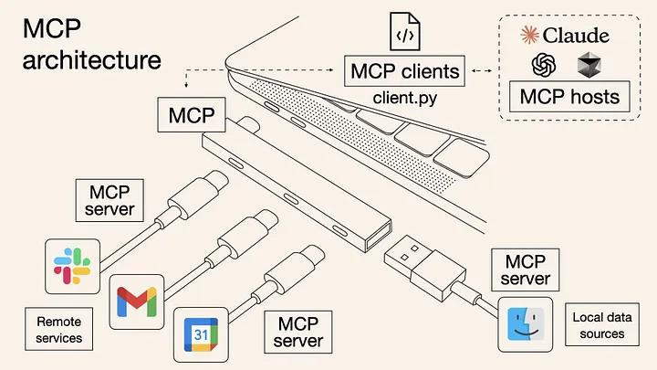
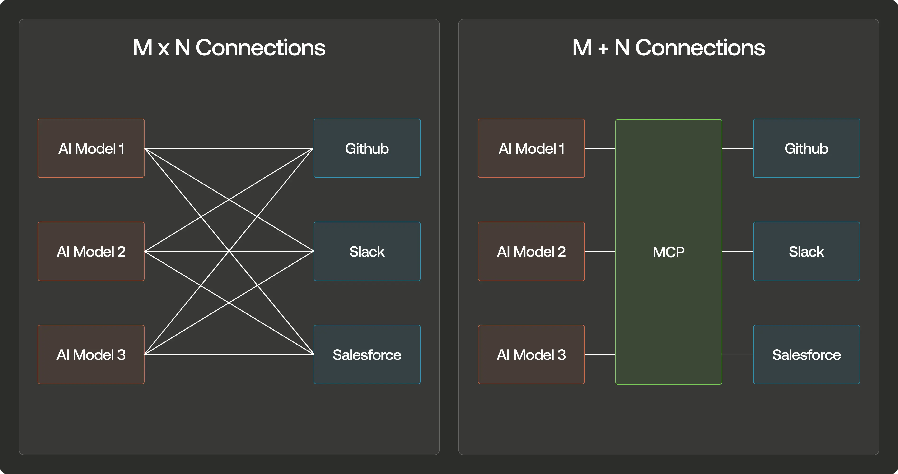
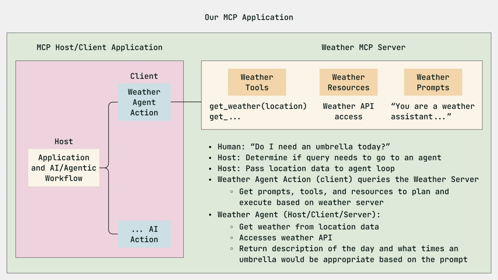
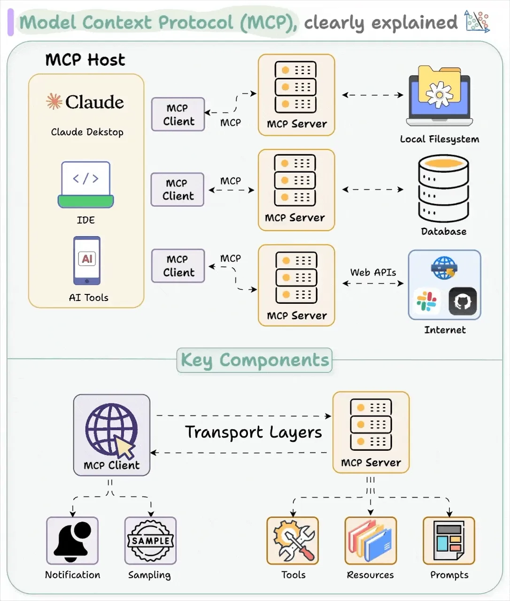
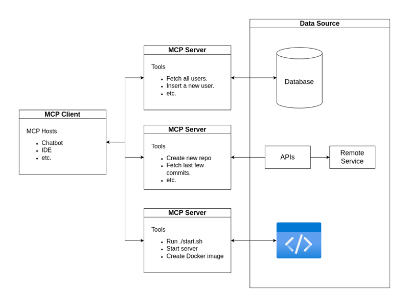

# Understanding Model Context Protocol (MCP)

## Introduction

As artificial intelligence (AI) continues to advance rapidly, a growing number of intelligent models such as Claude, GPT-4, and Gemini have emerged. However, connecting each of these AI models to external data sources and tools is often a complex and time-consuming process, requiring significant effort to establish and maintain individual integrations.

To address this challenge, the **Model Context Protocol (MCP)** was introduced as a standardized solution, simplifying the integration of AI models with external tools and data, making the process more efficient and seamless.

---

## Table of Contents

- [Understanding Model Context Protocol (MCP)](#understanding-model-context-protocol-mcp)
  - [Introduction](#introduction)
  - [Table of Contents](#table-of-contents)
  - [1. What is Model Context Protocol?](#1-what-is-model-context-protocol)
    - [1.1 Concept](#11-concept)
    - [1.2 Why Do We Need MCP?](#12-why-do-we-need-mcp)
      - [Illustrative Example](#illustrative-example)
    - [1.3 Comparing MCP with Traditional APIs](#13-comparing-mcp-with-traditional-apis)
  - [2. MCP Architecture Overview](#2-mcp-architecture-overview)
    - [2.1 General Architecture](#21-general-architecture)
      - [Key Components of MCP](#key-components-of-mcp)
      - [Connections to External Systems](#connections-to-external-systems)
      - [Communication Process Details](#communication-process-details)
  - [3. Real-World Applications](#3-real-world-applications)
    - [3.1 MCP Architecture in Practical Applications](#31-mcp-architecture-in-practical-applications)
      - [Analysis of Components in the Diagram](#analysis-of-components-in-the-diagram)
      - [Practical Example](#practical-example)
    - [3.2 Current Limitations of MCP](#32-current-limitations-of-mcp)
  - [References](#references)

---

## 1. What is Model Context Protocol?

### 1.1 Concept

First, let’s clarify what an LLM is. A **Large Language Model (LLM)** is an AI model trained on vast datasets of text to understand and generate natural language. It can answer questions, write content, translate languages, or function as a virtual assistant. Examples include GPT-4, Claude, and Gemini.

The **Model Context Protocol (MCP)** acts as a standardized protocol—comparable to a USB-C for AI—that enables LLMs to connect seamlessly with external data and tools. MCP is built on three core components:

- **Model**: Represents the core logic of an application, defining how data is structured and decisions are made. In AI, this could be a neural network for processing language or images.
- **Context**: Provides the environment in which the model operates, determining its behavior under various conditions, such as user interactions or system states. For example, a chatbot might respond differently based on the context of a conversation. Without proper context, models may produce irrelevant or biased results.
- **Protocol**: Establishes the communication rules between the model and context, ensuring that changes in context appropriately influence the model and vice versa.

  
*Figure 1: Illustration of the MCP concept.*

---

### 1.2 Why Do We Need MCP?

Before MCP, integrating AI models with external data sources was a complicated process lacking a unified standard. Large Language Models (LLMs) like GPT, Claude, and Gemini faced two key limitations:

- **Context Limitation**: They can only process and reason based on the information available in their current context.
- **Inability to Act**: While they can generate text, they are unable to interact with the external world.

This challenge is highlighted by the "M×N problem": connecting **M** AI models to **N** external tools requires building **M×N** individual integrations, resulting in a massive workload. MCP simplifies this to **M+N**.

For instance, a company using 4 AI models (Claude, GPT-4, Gemini, Deepseek) and aiming to integrate them with 5 external services (GitHub, Slack, Google Drive, Salesforce, and an internal database) would need 4×5=20 separate integrations without MCP. With MCP, they only need 4 MCP clients (one for each AI model) and 5 MCP servers (one for each service), totaling 4+5=9 components—a 55% reduction in complexity and development time.

  
*Figure 2: Comparison of integration complexity between traditional methods (M×N) and MCP (M+N).*

#### Illustrative Example

  
*Figure 3: Example illustrating MCP’s application in answering a user’s weather query.*

In this example, an MCP application consists of distinct components:

- **Host/Client Application**: Manages user actions and application logic.
- **Agent Task (Weather Agent Action)**: Receives user requests and performs actions using available tools and resources.
- **Weather MCP Server**: Manages weather tools, weather API resources, and prompts to assist users.

Consider a user query: *"Do I need an umbrella today?"* The process is as follows:

1. The user asks whether an umbrella is needed.
2. The host determines if the query requires an agent and forwards the user’s location data to the agent loop.
3. The Weather Agent Action (client) queries the Weather Server for weather data based on the provided location.
4. The Weather Agent (Host/Client/Server) retrieves weather data from the API, describes the day’s weather, and determines if an umbrella is needed based on the initial question.

Thanks to MCP, the AI processes information efficiently, delivering accurate and relevant answers to the user.

---

### 1.3 Comparing MCP with Traditional APIs

To understand MCP’s importance, let’s compare it with traditional REST APIs:

| **#** | **Feature**           | **MCP**                              | **Traditional REST APIs**          |
|-------|-----------------------|--------------------------------------|------------------------------------|
| 1     | **Communication**     | Bidirectional and real-time          | Typically one-way request-response |
| 2     | **Tool Discovery**    | Automatic and dynamic                | Requires manual configuration      |
| 3     | **Context Awareness** | Built-in                             | Limited or absent                  |
| 4     | **Scalability**       | Plug-and-play                        | Requires linear integration effort |
| 5     | **Standardization**   | Unified protocol for all models      | Varies by service                  |
| 6     | **Purpose**           | Designed specifically for AI models  | General-purpose                    |

This standardization marks a significant shift for anyone developing AI applications.

---

## 2. MCP Architecture Overview

### 2.1 General Architecture

The overall architecture of MCP is illustrated below:

  
*Figure 4: General architecture of MCP, including MCP Hosts, Clients, Servers, and connections to external systems.*

#### Key Components of MCP

| **#** | **Component**  | **Description**                                                                                       |
|-------|----------------|-------------------------------------------------------------------------------------------------------|
| 1     | **MCP Hosts**  | Programs or tools (e.g., Claude Desktop, IDEs, or AI tools) that access and use data via MCP.        |
| 2     | **MCP Client** | Facilitates communication with the MCP Server, sending requests and receiving responses. Each client maintains a 1:1 connection with servers. |
| 3     | **MCP Server** | Handles requests from clients, executing tasks as required. Can be a physical or virtual server.     |

#### Connections to External Systems

| **#** | **System**        | **Description**                                                                                   |
|-------|-------------------|---------------------------------------------------------------------------------------------------|
| 1     | **Local Filesystem** | Used for temporary storage or results from tasks.                                              |
| 2     | **Database**         | Stores long-term data, accessible for queries by servers or clients.                           |
| 3     | **Web APIs**         | Enables access to external information or services.                                            |
| 4     | **Internet**         | Facilitates connections to online services, such as cloud platforms or external tools/data.    |

Understanding the communication between MCP Clients and Servers is essential for building an MCP system. The process is illustrated below:

  
*Figure 5: Diagram illustrating the communication process between MCP Client and MCP Server.*

#### Communication Process Details

- The client sends an initial request to discover the server’s capabilities. For example: *"Please provide information about available weather-related tools and resources."*
- The server responds with detailed information about its capabilities, such as:
  - **Tools**: Available tools, e.g., weather APIs or data analysis tools.
  - **Prompt Templates**: Predefined prompts the client can use to interact with the server.
  - **Resources**: Available resources, e.g., weather data, analysis reports, or additional information.
- Once the capability exchange is complete, the system is ready for further message exchanges. The client can send more specific requests, and the server provides detailed responses. For example, after receiving weather tool information, the client might request weather forecasts for a specific city.

---

## 3. Real-World Applications

### 3.1 MCP Architecture in Practical Applications

  
*Figure 6: Diagram illustrating MCP architecture in a real-world application.*

#### Analysis of Components in the Diagram

| **#** | **Component**            | **Description**                                                                                     | **Example**                                                                                                                                                                                                                   |
|-------|--------------------------|-----------------------------------------------------------------------------------------------------|---------------------------------------------------------------------------------------------------------------------------------------------------------------------------------------------|
| 1     | **MCP Client (Hosts)**   | Programs or tools (e.g., chatbots, IDEs) that connect to MCP Servers to perform tasks.              | A chatbot acting as an MCP Client, where users send requests and receive responses from an MCP Server to query data or automate tasks.                                                      |
| 2     | **MCP Server**           | Processes requests from MCP Clients and provides tools for task execution. Each server may have unique tools. | - **Server 1**: Tools like `Fetch all users`, `Insert a new user`, connected to a database. \n- **Server 2**: Tools like `Create new repo`, `Fetch last few commits`, connected to APIs (e.g., GitHub). \n- **Server 3**: Tools like `Run script ./start.sh`, `Start server`, `Create Docker image`, interacting with remote services. |
| 3     | **Data Source**          | MCP Servers access databases for data retrieval/update or use APIs/remote services for actions.    | - Retrieve or add users from a database. \n- Create repositories, fetch commits, or run remote services via APIs or remote services.                                                       |

#### Practical Example

Cursor, originally a code editor, has leveraged MCP Clients to expand its functionality, transforming into an "everything app." By integrating with MCP Servers, Cursor enables users to perform various tasks without leaving their workspace:

- **Slack Client (via Slack MCP Server)**: Users can send messages or receive notifications from Slack directly within Cursor.
- **Email Sender (via Resend MCP Server)**: Cursor supports sending emails without opening a separate email app.
- **Image Generator (via Replicate MCP Server)**: Users can generate images, such as website banners, while coding.

---

### 3.2 Current Limitations of MCP

MCP has the potential to connect AI with tools, but it faces several limitations that need to be addressed:

| **#** | **Limitation**           | **Description**                                                                                   |
|-------|--------------------------|---------------------------------------------------------------------------------------------------|
| 1     | **Multi-User Support**   | Primarily supports single AI agents, not ideal for multi-user systems, limiting large-scale deployment. |
| 2     | **Standardized Authentication** | Lacks a unified authentication mechanism, posing security risks in complex systems.             |
| 3     | **Access Control**       | Lacks flexible permission control, offering only full access or none, complicating multi-user management. |
| 4     | **Tool Discovery**       | Manual process, not automated, time-consuming despite planned improvements by Anthropic.         |
| 5     | **Complex Workflows**    | Does not support seamless task chaining, requiring users to handle complexity manually.          |
| 6     | **User Experience**      | Inconsistent and unintuitive, lacking tool suggestions, making it less user-friendly for beginners. |
| 7     | **Error Handling**       | Difficult to identify and fix errors due to incomplete information, especially across systems.   |

---

## References

- [Model Context Protocol Official GitHub Repository](https://github.com/modelcontextprotocol) - Official GitHub page for MCP, including source code, documentation, and SDK.
- [DataCamp: "MCP: Model Context Protocol Tutorial" (15/03/2025)](https://www.datacamp.com/tutorial/mcp-model-context-protocol) - Detailed tutorial on MCP and its implementation.
- [Dev.to: "The Rise of Model Context Protocol in Docker Desktop" by Ajeet Raina (20/03/2025)](https://dev.to/ajeetraina/the-rise-of-model-context-protocol-in-docker-desktop-4fji) - Article on MCP applications in Docker Desktop.
- [DailyDoseofDS: "Visual Guide to Model Context Protocol" (10/03/2025)](https://blog.dailydoseofds.com/p/visual-guide-to-model-context-protocol) - Visual guide to MCP.
- [LinkedIn: "Model Context Protocol (MCP) in AI Software Development" by Piyush Ranjan (18/03/2025)](https://www.linkedin.com/pulse/model-context-protocol-mcp-ai-software-development-piyush-ranjan-dxj0e/) - Analysis of MCP in AI software development.
- [Digidop: "MCP: The AI Revolution" (12/03/2025)](https://www.digidop.com/blog/mcp-ai-revolution) - Article on MCP’s impact in AI.
- [a16z: "A Deep Dive into MCP and the Future of AI Tooling" (23/03/2025)](https://a16z.com/a-deep-dive-into-mcp-and-the-future-of-ai-tooling/) - In-depth analysis of MCP and the future of AI tooling.