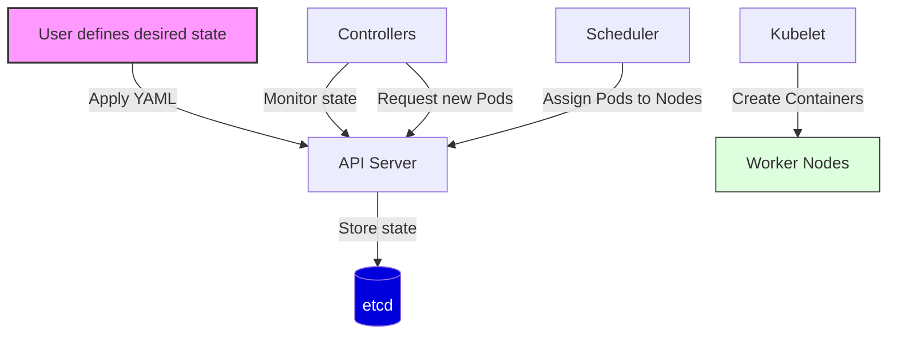
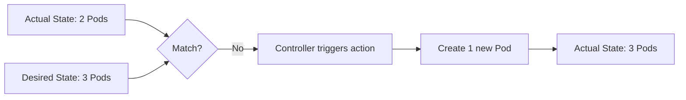
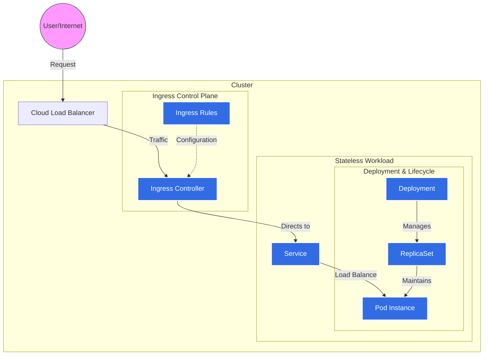

# Kubernetes Architecture Explained From First Principles

## 1. Introduction

When the number of applications and services increases, deploying and managing them becomes more complex. The system must ensure availability, scalability, and fault tolerance.

In the past, applications were deployed on virtual machines (VMs). However, virtual machines are relatively heavy and consume significant system resources. Containers were introduced to solve this problem. A container is a lightweight way to package an application together with its dependencies.

When the number of containers grows to hundreds or even thousands, manual management becomes extremely difficult. We need a system that can automatically:

- Deploy containers
- Scale containers
- Manage container lifecycle
- Provide load balancing

This is why container orchestration systems were created.

Kubernetes was developed by engineers at Google based on their experience running large-scale infrastructure. Before Kubernetes, Google used internal systems such as Borg and Omega to manage containers in their data centers. Kubernetes was designed based on the ideas and lessons learned from those systems.

## 2. Containers as the Foundation 

### 2.1 Containers vs Virtual Machines

#### Isolation Model 

Virtual machines create a full copy of an operating system for each application. Each VM includes the operating system, application binaries, and required libraries. This model provides strong isolation, but it is heavy and consumes more system resources.

Containers, on the other hand, run as isolated processes that share the host operating system kernel. Isolation is achieved using Linux namespaces and cgroups. Because containers share the host kernel, they are much lighter and require fewer resources.

#### Resource efficiency 

A virtual machine needs to boot a full operating system, which increases resource usage. As a result, a single server can usually run only a limited number of VMs.

Containers do not need to boot a full operating system. Instead, they start as normal processes on the host system. This allows a single server to run hundreds of containers efficiently.

### 2.2 Container Runtime 

#### What is Container Runtime?

A container runtime is the component responsible for executing and managing containers on a system.

Its responsibilities typically include:

* Pulling container images from a container registry.
* Creating containers from images.
* Managing the container lifecycle.
* Providing the execution environment for containers.

#### OCI Standard 

To ensure container compatibility across different platforms, the community created the Open Container Initiative (OCI).

OCI defines standards for:
* Container image format.
* Runtime specifications.

Thanks to these standards, a container image can run on many different container runtimes.

#### Role of Container Runtime 

Kubernetes does not run containers directly. Instead, it relies on a container runtime to:
* Create containers.
* Start and stop containers.
* Manage the container lifecycle.

#### Example Runtimes 

Some popular container runtimes include:
* **containerd** — the most widely used runtime in Kubernetes environments.
* **CRI-O** — a runtime designed specifically for Kubernetes.
* **Docker Engine** — previously used by Kubernetes before dockershim was removed.

## 3. Kubernetes Architecture

Kubernetes is designed as a distributed system. A Kubernetes cluster consists of two main components:

* **Control Plane**: Responsible for managing and coordinating the cluster.
* **Worker Nodes**: Where the containers actually run.

The Control Plane makes global decisions about the cluster, while Worker Nodes execute the assigned workloads.

### 3.1 Control Plane Components

#### kube-apiserver

The API Server is the communication hub for Kubernetes. All other components in the cluster interact with Kubernetes through the API Server.

For example:
* **kubectl** sends requests to the API Server.
* **Controllers** read the cluster state from the API Server.
* **kubelet** reports the node state back to the API Server.

The API Server is also responsible for authentication, authorization, and request validation.

#### etcd

etcd is a distributed key-value database for Kubernetes. It stores the entire state of the cluster, including Pods, Deployments, ConfigMaps, Secrets, Nodes, and more.

Because etcd stores critical state information, it should always be deployed as a High Availability (HA) cluster.

#### scheduler

The Scheduler is responsible for deciding which node will run a specific Pod.

When a new Pod is created:
1. The Pod information is written into etcd through the API Server.
2. The Scheduler detects that the Pod has not been assigned to a node.
3. The Scheduler selects the most appropriate node to run the Pod.

The Scheduler makes these decisions based on several factors: CPU/Memory requirements, node labels, affinity/anti-affinity rules, and taints/tolerations.

#### Controller Manager

The Controller Manager runs various control loops. Each controller is responsible for ensuring that the actual state of the cluster matches the desired state.

Example: The **ReplicaSet Controller** ensures that the correct number of Pods are running at all times.

#### Cloud Controller Manager

The Cloud Controller Manager is the component that integrates with cloud providers. It decouples cloud-specific logic from the Kubernetes core, allowing for an isolated running environment.

The Cloud Controller Manager manages:
* **Node Controller**: Syncing node information with the cloud infrastructure.
* **Route Controller**: Managing the routing infrastructure within the cloud network.
* **Service Controller**: Managing cloud LoadBalancer services.
* **Volume Controller**: Managing cloud-based storage volumes.

### 3.2 Worker Node Components

#### kubelet

The kubelet is an agent that runs on each node in the cluster. Its primary responsibilities include:

* Getting **PodSpecs** from the API Server.
* Creating containers via the **Container Runtime**.
* Monitoring the status of containers.
* Reporting the state of the node back to the **Control Plane**.

#### kube-proxy

**kube-proxy** is responsible for network routing within the cluster. It ensures that network rules are maintained on nodes.

It establishes network rules (such as **iptables** or **IPVS**) to:
* Forward traffic to the correct Pod.
* Perform load balancing across multiple Pods of a Service.

**kube-proxy** is the essential component that enables **Kubernetes Services** to function.

#### Container Runtime

The **Container Runtime** is the software responsible for executing containers. It handles the low-level operations such as:
* Pulling container images from a registry.
* Starting and stopping containers.
* Managing the overall container lifecycle.

### 3.3 The Reconciliation Loop

The **Reconciliation Loop** is the most fundamental concept of Kubernetes. Kubernetes is a **declarative** system. Instead of giving a series of commands (imperative), the user defines the **desired state** of the cluster, and Kubernetes constantly works to achieve and maintain that state.

**Example**: If you set `replicas: 3` in a Deployment, Kubernetes will ensure that there are exactly 3 running Pods at all times.

#### The Deployment Flow

#### How it handles failures

If a Pod crashes or a node fails, the loop detects the **discrepancy** between the actual state and the desired state and takes action immediately.

## 4. Kubernetes Core Abstractions

### 4.1 The Pod: The Smallest Deployable Unit

A Pod is the basic execution unit of a Kubernetes application—the smallest and simplest unit in the Kubernetes object model that you create or deploy.

#### Shared Resources
A Pod encapsulates one or more applications (containers), storage resources, a unique network identity (IP address), and options that govern how the container(s) should run. Containers within a Pod share:

- **Network Namespace**: All containers in a Pod share the same IP address and port space. They can communicate with each other using `localhost`.
- **IPC (Inter-Process Communication)**: Containers can use standard IPC (like SystemV semaphores or POSIX shared memory) to communicate.
- **Volumes**: Pods can specify shared storage volumes that all containers in the Pod can access.

#### Deep Dive: Pod Sandbox and the Pause Container
When you look at a node running a Pod, you might notice an extra container running that you didn't define. This is the **Pause Container** (also known as the Infrastructure Container).

The Pause Container serves several critical purposes:

1. **Sandbox**: It acts as the "anchor" for the Pod's namespaces (Network, IPC, etc.).
2. **Lifecycle Management**: When the Pause container starts, it creates the namespaces that the other containers in the Pod will join. If your application container restarts, it simply joins the existing namespaces held by the Pause container, ensuring the IP address remains the same.
3. **Zombie Process Reaping**: It acts as `PID 1` for the Pod, reaping zombie processes that might be orphaned by other containers.

### 4.2 The Controller Model

Kubernetes doesn't just run Pods; it manages their lifecycle through **Controllers**. These controllers manage "Workload" resources that abstract the creation of Pods.

| Resource | Primary Use Case | Key Features |
| :--- | :--- | :--- |
| **Deployment** | Stateless Applications | Rolling updates, rollbacks, and horizontal scaling. |
| **ReplicaSet** | Pod Maintenance | Ensures a specific number of Pod replicas are running. |
| **StatefulSet** | Stateful Applications | Stable network identities (web-0, web-1) and stable storage. |
| **DaemonSet** | Node-level Services | Runs a Pod on every node (e.g., logging, monitoring). |

### 4.3 Desired State vs. Actual State

The "magic" of Kubernetes lies in the constant comparison between the **Desired State** (what you asked for in your YAML) and the **Actual State** (what is currently running in the cluster).

1. **Observation**: The Controller Manager watches the API Server to see the current state.
2. **Diffing**: It compares the actual state against the desired state stored in `etcd`.
3. **Acting**: If there is a "drift" (e.g., a Pod crashed), the controller takes action (e.g., starts a new Pod) to reconcile the state.

This declarative approach makes systems resilient and self-healing.

## 5. Services, Ingress, and Networking

Networking in Kubernetes is built on the principle that every Pod should have its own IP address and can communicate with every other Pod in the cluster without NAT.

### 5.1 Kubernetes Service

Because Pods are ephemeral (they can die and be replaced with new IPs), we need a stable way to access them. This is where the **Service** comes in.

- **ClusterIP (Default)**: Exposes the Service on a cluster-internal IP. Choosing this value makes the Service only reachable from within the cluster.
- **NodePort**: Exposes the Service on each Node's IP at a static port. You can contact the Service from outside the cluster by requesting `<NodeIP>:<NodePort>`.
- **LoadBalancer**: Exposes the Service externally using a cloud provider's load balancer.

### 5.2 Ingress

While a Service (LoadBalancer) works for one application, it becomes expensive to have a dedicated Load Balancer for every service. **Ingress** acts as an API gateway or reverse proxy (like Nginx) that manages external access to the services in a cluster, typically HTTP/HTTPS.

#### Traffic Flow Visualization

The following diagram shows how an external request travels from the Internet to a running application instance.

## 6. Configuration and Storage

### 6.1 ConfigMaps and Secrets

To keep containers portable, you shouldn't hardcode configuration inside images.
- **ConfigMap**: Stores non-sensitive configuration data (e.g., database URLs).
- **Secret**: Stores sensitive data like passwords, tokens, or SSH keys (encoded in Base64).

### 6.2 Persistent Storage: PV and PVC

Since containers have ephemeral file systems, data is lost if a container restarts. Kubernetes separates storage *provisioning* from storage *usage*:

1. **PersistentVolume (PV)**: A piece of storage in the cluster that has been provisioned by an administrator or dynamically provisioned using Storage Classes.
2. **PersistentVolumeClaim (PVC)**: A request for storage by a user. It is similar to a Pod; a Pod consumes node resources and a PVC consumes PV resources.

## 7. Conclusion

Kubernetes is a powerful platform because it abstracts the underlying infrastructure and provides a consistent API for managing containers at scale. By understanding the core components—from the Control Plane to Pods and Controllers—you can build systems that are significantly more resilient and easier to scale.

Whether you are deploying a simple web app or a complex microservices architecture, the principles of **declarative state** and **reconciliation loops** remain the heart of everything Kubernetes does.

## 8. References

- [Kubernetes Documentation](https://kubernetes.io/docs/home/)
- [Kubernetes Components](https://kubernetes.io/docs/concepts/overview/components/)
- [Understanding Kubernetes Objects](https://kubernetes.io/docs/concepts/overview/working-with-objects/kubernetes-objects/)
- [Ingress Controllers](https://kubernetes.io/docs/concepts/services-networking/ingress-controllers/)

