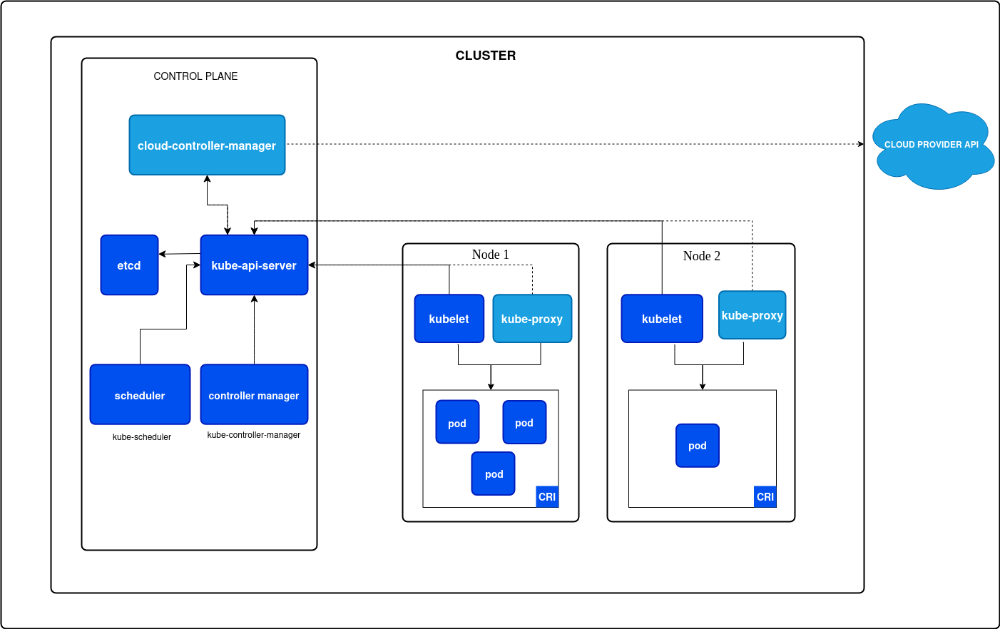
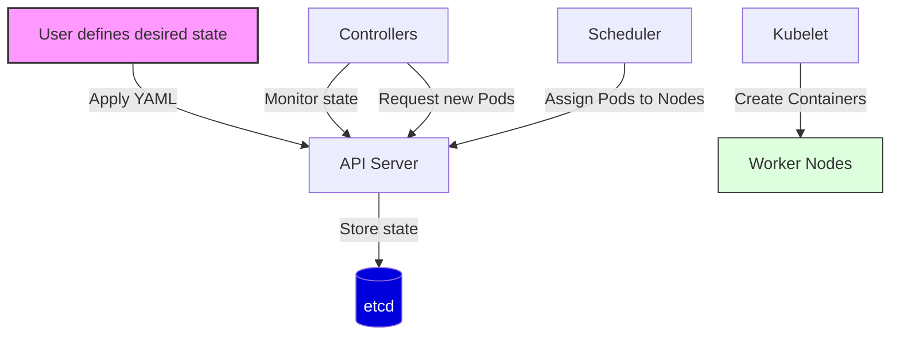
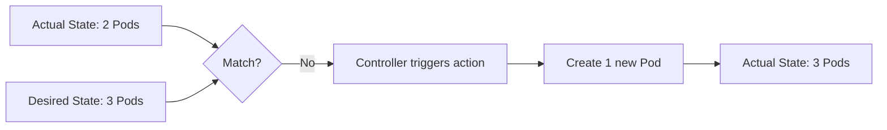

# Kubernetes Architecture Explained From First Principles

## 1. Introduction

When the number of applications and services increases, deploying and managing them becomes more complex. The system must ensure availability, scalability, and fault tolerance.

In the past, applications were deployed on virtual machines (VMs). However, virtual machines are relatively heavy and consume significant system resources. Containers were introduced to solve this problem. A container is a lightweight way to package an application together with its dependencies.

When the number of containers grows to hundreds or even thousands, manual management becomes extremely difficult. We need a system that can automatically:

- Deploy containers
- Scale containers
- Manage container lifecycle
- Provide load balancing

This is why container orchestration systems were created.

Kubernetes was developed by engineers at Google based on their experience running large-scale infrastructure. Before Kubernetes, Google used internal systems such as Borg and Omega to manage containers in their data centers. Kubernetes was designed based on the ideas and lessons learned from those systems.

## 2. Containers as the Foundation 

### 2.1 Containers vs Virtual Machines

#### Isolation Model 

Virtual machines create a full copy of an operating system for each application. Each VM includes the operating system, application binaries, and required libraries. This model provides strong isolation, but it is heavy and consumes more system resources.

Containers, on the other hand, run as isolated processes that share the host operating system kernel. Isolation is achieved using Linux namespaces and cgroups. Because containers share the host kernel, they are much lighter and require fewer resources.

#### Resource efficiency 

A virtual machine needs to boot a full operating system, which increases resource usage. As a result, a single server can usually run only a limited number of VMs.

Containers do not need to boot a full operating system. Instead, they start as normal processes on the host system. This allows a single server to run hundreds of containers efficiently.

### 2.2 Container Runtime 

#### What is Container Runtime?

A container runtime is the component responsible for executing and managing containers on a system.

Its responsibilities typically include:

* Pulling container images from a container registry.
* Creating containers from images.
* Managing the container lifecycle.
* Providing the execution environment for containers.

#### OCI Standard 

To ensure container compatibility across different platforms, the community created the Open Container Initiative (OCI).

OCI defines standards for:
* Container image format.
* Runtime specifications.

Thanks to these standards, a container image can run on many different container runtimes.

#### Role of Container Runtime 

Kubernetes does not run containers directly. Instead, it relies on a container runtime to:
* Create containers.
* Start and stop containers.
* Manage the container lifecycle.

#### Example Runtimes 

Some popular container runtimes include:
* **containerd** — the most widely used runtime in Kubernetes environments.
* **CRI-O** — a runtime designed specifically for Kubernetes.
* **Docker Engine** — previously used by Kubernetes before dockershim was removed.

## 3. Kubernetes Architecture

Kubernetes is designed as a distributed system. A Kubernetes cluster consists of two main components:

* **Control Plane**: Responsible for managing and coordinating the cluster.
* **Worker Nodes**: Where the containers actually run.

The Control Plane makes global decisions about the cluster, while Worker Nodes execute the assigned workloads.

### 3.1 Control Plane Components

#### kube-apiserver

The API Server is the communication hub for Kubernetes. All other components in the cluster interact with Kubernetes through the API Server.

For example:
* **kubectl** sends requests to the API Server.
* **Controllers** read the cluster state from the API Server.
* **kubelet** reports the node state back to the API Server.

The API Server is also responsible for authentication, authorization, and request validation.

#### etcd

etcd is a distributed key-value database for Kubernetes. It stores the entire state of the cluster, including Pods, Deployments, ConfigMaps, Secrets, Nodes, and more.

Because etcd stores critical state information, it should always be deployed as a High Availability (HA) cluster.

#### scheduler

The Scheduler is responsible for deciding which node will run a specific Pod.

When a new Pod is created:
1. The Pod information is written into etcd through the API Server.
2. The Scheduler detects that the Pod has not been assigned to a node.
3. The Scheduler selects the most appropriate node to run the Pod.

The Scheduler makes these decisions based on several factors: CPU/Memory requirements, node labels, affinity/anti-affinity rules, and taints/tolerations.

#### Controller Manager

The Controller Manager runs various control loops. Each controller is responsible for ensuring that the actual state of the cluster matches the desired state.

Example: The **ReplicaSet Controller** ensures that the correct number of Pods are running at all times.

#### Cloud Controller Manager

The Cloud Controller Manager is the component that integrates with cloud providers. It decouples cloud-specific logic from the Kubernetes core, allowing for an isolated running environment.

The Cloud Controller Manager manages:
* **Node Controller**: Syncing node information with the cloud infrastructure.
* **Route Controller**: Managing the routing infrastructure within the cloud network.
* **Service Controller**: Managing cloud LoadBalancer services.
* **Volume Controller**: Managing cloud-based storage volumes.

### 3.2 Worker Node Components

#### kubelet

The kubelet is an agent that runs on each node in the cluster. Its primary responsibilities include:

* Getting **PodSpecs** from the API Server.
* Creating containers via the **Container Runtime**.
* Monitoring the status of containers.
* Reporting the state of the node back to the **Control Plane**.

#### kube-proxy

**kube-proxy** is responsible for network routing within the cluster. It ensures that network rules are maintained on nodes.

It establishes network rules (such as **iptables** or **IPVS**) to:
* Forward traffic to the correct Pod.
* Perform load balancing across multiple Pods of a Service.

**kube-proxy** is the essential component that enables **Kubernetes Services** to function.

#### Container Runtime

The **Container Runtime** is the software responsible for executing containers. It handles the low-level operations such as:
* Pulling container images from a registry.
* Starting and stopping containers.
* Managing the overall container lifecycle.

### 3.4 The Reconciliation Loop

The **Reconciliation Loop** is the most fundamental concept of Kubernetes. Kubernetes is a **declarative** system. Instead of giving a series of commands (imperative), the user defines the **desired state** of the cluster, and Kubernetes constantly works to achieve and maintain that state.

**Example**: If you set `replicas: 3` in a Deployment, Kubernetes will ensure that there are exactly 3 running Pods at all times.

#### The Deployment Flow

#### How it handles failures

If a Pod crashes or a node fails, the loop detects the **discrepancy** between the actual state and the desired state and takes action immediately.

