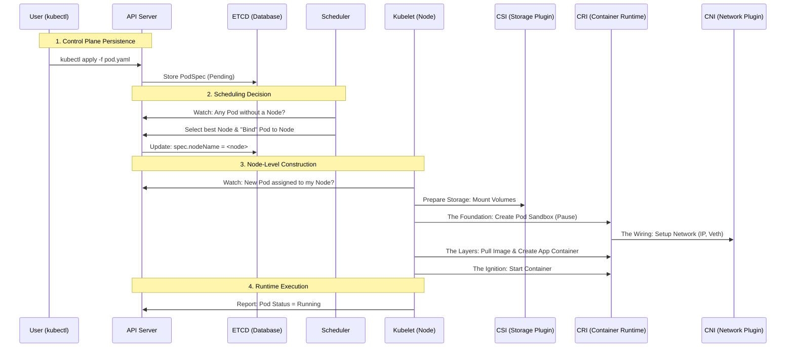
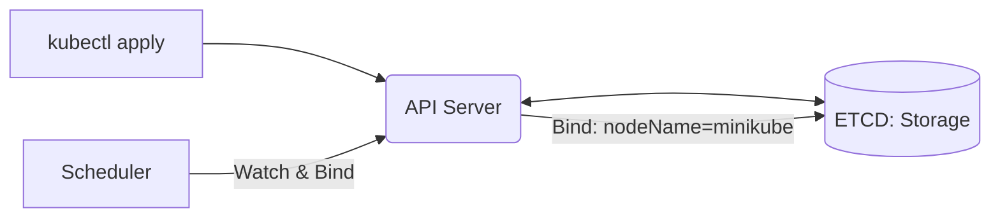
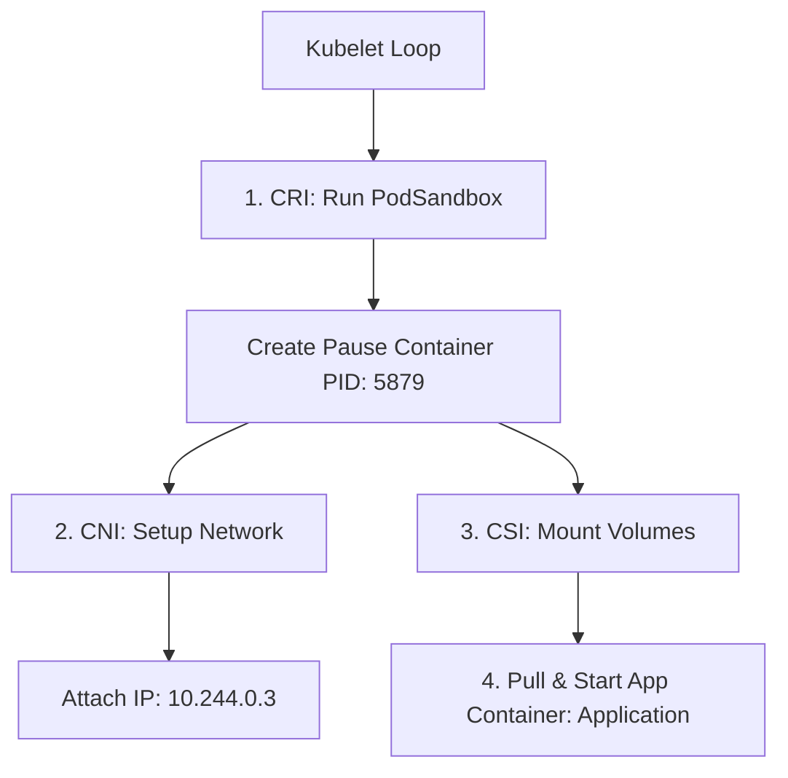
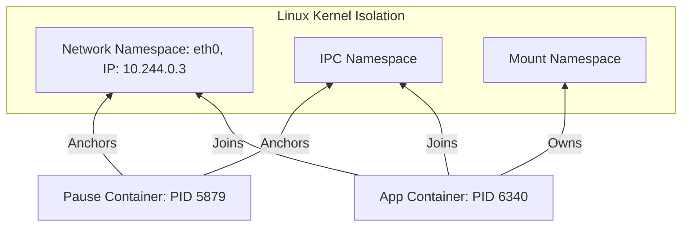
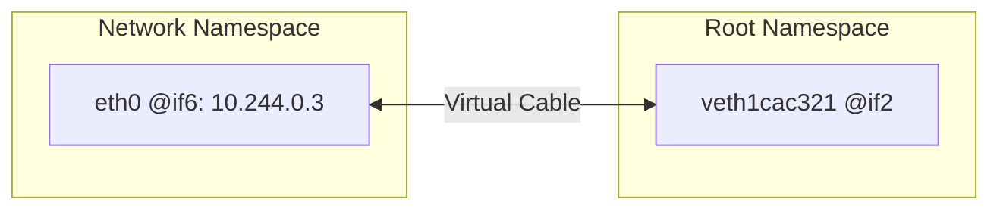
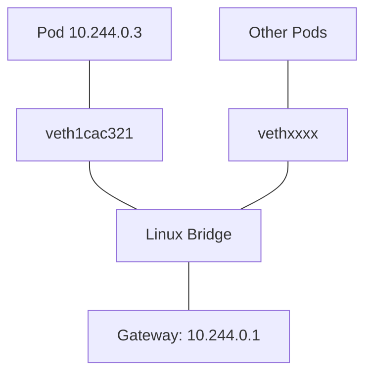
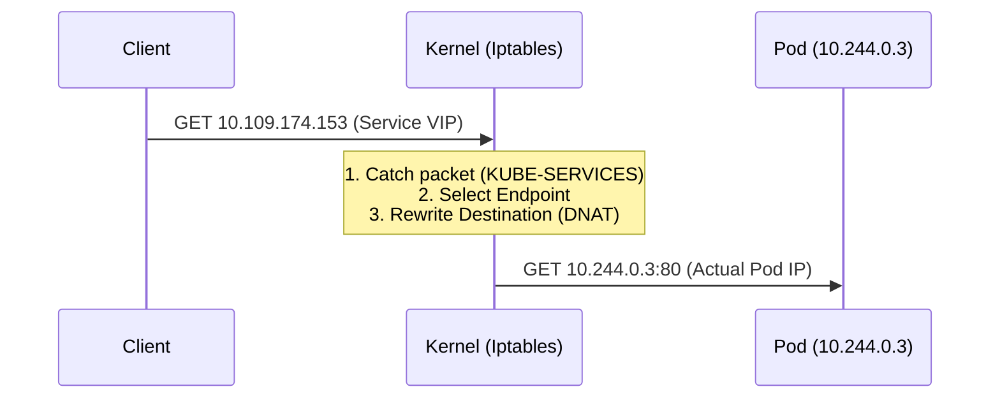
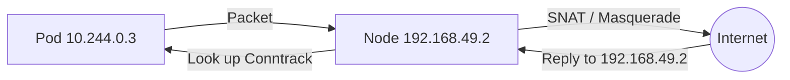
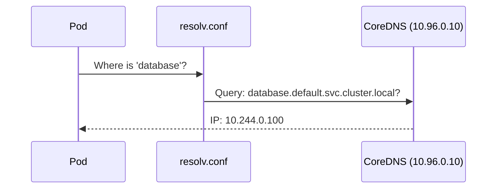

---

slug: pod

title: The Hidden Life of a Kubernetes Pod

authors: [vinh]

tags: [Kubernetes]

---

# The Hidden Life of a Kubernetes Pod

## 1. Pod doesn't exist

If you SSH into a Kubernetes worker node and run:

```bash
ps aux | grep pod
```

You won't see anything.

There is no process named *pod*, no binary called *pod*, and no kernel object called *pod*.

The Linux kernel doesn't know what a Pod is.

So what is a Pod?

Documentation often says:

> Pod is the smallest deployable unit in Kubernetes.

That is correct, but it doesn't really help when debugging production issues.

A Platform/DevOps engineer should think about it differently:

> A Pod is not an object. A Pod is an environment contract.

More specifically, a Pod is essentially a collection of Linux primitives assembled by the kubelet:

```
Linux namespaces
+ cgroups
+ network namespace
+ volume mounts
+ container runtime
+ CNI networking
+ CSI storage
```

Kubernetes doesn't actually *create a Pod*.

Instead, Kubernetes assembles Linux building blocks into a single execution sandbox.

A better mental model is:

> Pod = Linux isolation bundle

Another useful way to think about it:

Instead of thinking:

```
Pod → container group
```

Think:

```
Pod → Linux environment
```

It is similar to a lightweight VM built from kernel primitives.

But unlike a VM:

* There is no hypervisor
* No guest OS
* Only namespaces and cgroups

## 2. The Big Picture: End-to-End Pod Lifecycle

Instead of thinking in sequential time, it's better to think about the **technical layers** a Pod passes through before it becomes a running process on a Node.



### Key Lifecycle Milestones

*   **Control Plane Persistence**: The Pod exists only as a "legal document" in ETCD. No containers exist yet; this is purely **desired state storage**.
*   **Scheduling Decision**: The Scheduler selects a Node and updates `spec.nodeName`. Still no containers; this is only a **placement decision**.
*   **Node-Level Construction**: Kubelet calls **CRI**, **CNI**, and **CSI** to build the environment. Kubernetes moves from **cluster decision** to **Linux construction**.
*   **Runtime Execution**: Once sandbox, networking, and volumes are ready, the Pod transitions to **Running**. The Linux isolation bundle becomes real.

At a high level, this lifecycle appears straightforward.

However, each milestone hides a complex set of Kubernetes control loops and Linux kernel mechanisms.

To truly understand how a Pod works, we need to start with how the control plane makes its decisions.

## 3. Control Plane Internals: How Kubernetes Decides

Before a Pod can run, Kubernetes must first make several decisions.

When you create a new Pod, nothing happens immediately on the Worker Node: no containers, no networking, and no volumes are created. At this stage, Kubernetes is only making decisions. All of these processes happen in the Control Plane.

The Control Plane does not run workloads. It only answers two questions:

* What does this Pod need?
* Where should this Pod run?



### 3.1 API Server: The only gateway of Kubernetes

Every Pod starts with an API request:

```bash
kubectl apply -f pod.yaml
```

This command does not create a container.

Instead, it sends an HTTP request to the API Server. The API Server will:

* authenticate the request
* authorize the request
* validate the schema
* run admission controllers
* apply default values

Only after passing all these steps is the Pod persisted.

Important principle:

**Kubernetes always stores the desired state before creating the runtime state.**

### 3.2 etcd: Source of truth of Kubernetes

After validation, the PodSpec is stored in etcd. You can verify this directly:

``` bash
kubectl exec -n kube-system etcd-minikube -- etcdctl get /registry/pods/default/lab-internals
```

Result:

```json
{
  "apiVersion": "v1",
  "kind": "Pod",
  "metadata": {
    "name": "lab-internals",
    "namespace": "default",
    "uid": "774770ad-9fd6-463d-aa60-7f25a3a8e989"
  },
  "spec": {
    "containers": [
      {
        "name": "nginx-container",
        "image": "nginx",
        "resources": {
          "limits": { "cpu": "200m", "memory": "128Mi" },
          "requests": { "cpu": "100m", "memory": "64Mi" }
        }
      }
    ],
    "nodeName": "minikube"
  }
}
```

The important thing you should know: At this time, pod is just a record in database. It includes `container spec`, `resource request`, `metadata`. But no process, no network, no filesystem.

### 3.3 Scheduler: the brain decide placement

The Scheduler continuously watches for Pods that are not yet assigned to a Node.

Its main responsibility is to select the most appropriate Node.

This process has two phases:

* `Filtering phase`: Filter out nodes that do not meet the requirements: CPU, RAM, Lables, Taints. Only keep eligible nodes.
* `Scoring phase`: The remaining nodes are scored based on: `Resource availibility`, `Spreading`, `Topology constraints`.  The node with the highest score will be selected.

You can verify this decision:

```bash
kubectl get events
```

Example:

```bash
Successfully assigned default/lab-internals to minikube
```

### Key takeaway

The control plane never creates containers. It only makes placement and configuration decisions. Actual execution begins only when the Kubelet reconciles the Pod on the assigned Node.

## 4. Node Execution Internals: How Kubelet Builds a Pod

Once the Scheduler assigns a Pod to a Node, responsibility shifts to the Kubelet. The Kubelet turns a PodSpec from a JSON document into an actual runtime environment on the Node. Unlike what many engineers assume, the Kubelet does not directly start containers. Instead, it communicates with the container runtime through the **Container Runtime Interface (CRI)**. At this stage Kubernetes moves from **cluster-level decision to node-level execution**.



### 4.1 Kubelet reconciliation loop

The Kubelet continuously watches the API Server for Pods assigned to its Node and compares the desired state with the actual state. If the Pod does not exist yet, it begins the creation process. Conceptually this looks like:

```
Watch PodSpec
→ Compare desired vs actual state
→ Create missing components
→ Report status
→ Repeat
```

This process is called the **reconciliation loop**, one of the core design patterns of Kubernetes. The key idea is that Kubelet does not "run Pods"; it continuously tries to make reality match the specification.

### 4.2 CRI: How Kubelet talks to the container runtime

Kubelet does not create containers itself. Instead, it communicates with runtimes such as **containerd** or **CRI-O** through CRI. The CRI exposes operations like RunPodSandbox, CreateContainer, StartContainer, and StopContainer. A typical creation sequence looks like:

```
RunPodSandbox
→ Setup networking
→ Pull images
→ Create containers
→ Start containers
```

The surprising detail is the first step: Kubernetes does not start the application container first. It starts the **Pod Sandbox**.

### 4.3 PodSandbox: The hidden foundation of every Pod

Before any application container starts, Kubernetes creates a special container called the **pause container**. Most engineers never notice it, but it is the most important container in the Pod. Its purpose is not to run application code but to hold Linux namespaces alive. You can observe it using:

```bash
crictl ps
```

or:

```bash
docker ps
```

Typically it appears as something like:

```
k8s_POD_lab-internals
```

### 4.4 Why Kubernetes needs the pause container

This design comes from a fundamental Linux rule: a namespace exists only while at least one process is attached to it. If the last process exits, the namespace disappears. Kubernetes needs the Pod network and IPC environment to survive container restarts, so it creates a minimal container whose only job is to keep these namespaces alive. The pause container therefore acts as a **namespace anchor process**.

### 4.5 How containers join the Pod environment

Once the pause container establishes the namespaces, application containers are started and attached to those namespaces. From Linux's perspective, they are simply processes inside the same isolation environment. This explains why containers inside a Pod can communicate via localhost, share network interfaces, and use IPC mechanisms.

You can verify namespace sharing:

```bash
lsns -p <pid>
```

Example:

```
PID   COMMAND   TYPE
6340  nginx     mnt, uts, pid
5879  pause     net, ipc
```

### 4.6 Pod creation order inside the Node

The typical creation order looks like:

```
Create PodSandbox
→ Setup networking
→ Pull image
→ Create container
→ Start process
```

This explains why a Pod IP usually does not change when a container restarts. The network namespace belongs to the pause container rather than the application container, which keeps the Pod networking stable.

### Key takeaway

Kubelet does not simply start containers. It first constructs an execution environment and then places containers inside it. The pause container acts as the invisible foundation that keeps the Pod environment stable even when application containers restart.

## 5. Linux Primitives: How the Kernel Implements a Pod

So far we have seen how Kubernetes decides where a Pod should run and how Kubelet constructs the execution environment. But Kubernetes itself does not provide isolation. All isolation is actually implemented by the Linux kernel.

In reality, a Pod is just a combination of several Linux primitives working together:

```
Namespaces → isolation
Cgroups → resource control
Filesystem mounts → storage
```

Kubernetes does not invent new isolation mechanisms. It orchestrates existing Linux features.

---

### 5.1 Namespaces: How Kubernetes isolates environments

Linux namespaces are the foundation of container isolation. They allow processes to have separate views of system resources.



The most important namespaces used by Pods are:

* **PID namespace** → process isolation
* **NET namespace** → network isolation
* **MNT namespace** → filesystem isolation
* **IPC namespace** → inter-process communication
* **UTS namespace** → hostname isolation

This is how multiple Pods can run on the same Node without interfering with each other.

You can verify this directly:

```bash
lsns -p <container_pid>
```

Example:

```
PID   COMMAND   TYPE
6340  nginx     mnt, uts, pid
5879  pause     net, ipc
```

This shows how different containers share or own different namespaces. The pause container typically holds the network namespace, while application containers join it.

From the kernel perspective, a Pod is simply a group of processes attached to the same namespaces.

---

### 5.2 Cgroups: How Kubernetes enforces resource limits

While namespaces isolate environments, **cgroups control how much resources a Pod can use.**

When you define resource limits:

```yaml
resources:
  limits:
    cpu: 200m
    memory: 128Mi
```

Kubernetes does not enforce this itself. Instead, Kubelet translates these limits into Linux cgroup constraints.

You can see this mapping:

```bash
tree /sys/fs/cgroup/kubepods.slice -L 3
```

Example structure:

```
kubepods.slice
├── kubepods-besteffort.slice
├── kubepods-burstable.slice
│   └── kubepods-burstable-pod774770ad.slice
│       ├── memory.max
│       ├── cpu.max
│       ├── pause container
│       └── nginx container
└── kubepods-guaranteed.slice
```

This hierarchy reflects Kubernetes QoS classes:

* **Guaranteed** → highest priority
* **Burstable** → medium priority
* **BestEffort** → lowest priority

When the Node runs out of memory, the Linux OOM Killer uses this hierarchy to decide which Pods to terminate first.

This shows an important truth:

Resource limits in Kubernetes are not abstract settings.

They become actual kernel enforcement rules.

---

### 5.3 Storage: How volumes become filesystem mounts

Storage in Kubernetes is also implemented using basic Linux filesystem operations. When a Pod requests a volume, Kubelet works with CSI drivers to attach the storage and then mounts it into the container filesystem.

You can observe this:

```bash
docker inspect <container_id>
```

Example mounts:

```
Source:
/var/lib/kubelet/pods/<uid>/volumes/...
Destination:
/var/run/secrets/kubernetes.io/serviceaccount
```

This reveals an important implementation detail:

Kubernetes does not copy files into containers.

It uses **bind mounts** to map directories from the host into the container filesystem.

Typical mounts include:

* ServiceAccount tokens
* ConfigMaps
* Secrets
* `/etc/hosts`
* termination logs

From Linux's perspective, these are just mount operations inside the container's mount namespace.

---

### 5.4 Mapping Kubernetes concepts to Linux reality

At this point we can clearly map Kubernetes abstractions to Linux mechanisms:

| Kubernetes Concept | Linux Implementation |

| ------------------ | -------------------- |

| Pod                | Namespace bundle     |

| Container limits   | Cgroups              |

| Volume             | Bind mount           |

| Pod network        | Network namespace    |

| Pod isolation      | Namespace grouping   |

This leads to one of the most important insights about Kubernetes internals:

Kubernetes does not create resources.

It programs Linux.

---

### Key takeaway

A Pod is not a native Linux object. It is a carefully constructed environment built from namespaces, cgroups, and mounts. Kubernetes provides orchestration logic, but the actual isolation and enforcement are performed entirely by the Linux kernel.

## 6. Network Internals: How Packets Actually Reach a Pod

So far we have seen how Kubernetes schedules Pods and how Linux provides isolation. But one of the most complex parts of Kubernetes is networking. A fundamental question remains:

How does a packet actually reach a Pod?

The answer is not a single component but a chain of Linux networking mechanisms working together:

```
CNI → veth pair → bridge → routing → iptables → conntrack → DNS
```

Kubernetes networking is not magic. It is Linux networking automation.

---

## 6.1 CNI: How a Pod gets its network interface

When Kubelet creates the PodSandbox, it calls the CNI plugin to configure networking. The CNI plugin is responsible for:

* creating a network namespace
* creating a veth pair
* assigning an IP address
* configuring routing rules

The most important concept here is the **veth pair**.

A veth pair is essentially a virtual cable with two ends:



You can verify this inside the Pod namespace:

```bash
sudo nsenter -t 5879 -n ip link
```

Example:

```bash
2: eth0@if6
```

This indicates the Pod interface connects to interface index 6 on the host.

Checking the host:

```bash
ip link | grep "^6:"
```

Example:

```
6: veth1cac321@if2
```

This confirms both ends of the same virtual cable.

---

## 6.2 Bridge: The virtual switch of the Node

The host-side veth does not connect directly to the internet. Instead, it connects to a Linux bridge which acts as a virtual switch.



You can see the bridge:

```bash
ip link show bridge
```

Example:

```
bridge: <BROADCAST,MULTICAST,UP>
```

This bridge typically acts as the gateway for the Pod network.

Example routing inside the Pod:

```bash
sudo nsenter -t 5879 -n ip route
```

Result:

```
default via 10.244.0.1 dev eth0
```

This shows the Pod sends traffic to the bridge gateway first.

From the Node perspective:

```bash
ip route | grep bridge
```

Example:

```
10.244.0.0/16 dev bridge
```

This shows the Node knows how to route traffic for the Pod CIDR.

---

## 6.3 Service networking: The iptables illusion

One of the biggest misconceptions is that Kubernetes Services are load balancers. In reality, Services are implemented as iptables rules programmed by kube-proxy.

When a client connects to a Service IP:



The key mechanism is **DNAT (Destination NAT)**.

Example rules:

```bash
sudo iptables -t nat -S
```

Typical flow:

1. Packet hits KUBE-SERVICES chain
2. Rule matches Service IP
3. Packet jumps to KUBE-SVC chain
4. Packet DNATed to Pod IP

Example DNAT rule:

``` bash
DNAT --to-destination 10.244.0.3:80
```

This is the exact moment where the virtual Service IP disappears and the real Pod IP is substituted.

From the client perspective nothing changed. From the kernel perspective the destination was rewritten.

---

## 6.4 Conntrack: The invisible state machine

DNAT alone would break return traffic if Linux did not remember the translation. This is where **conntrack** becomes critical.

Conntrack maintains a state table of NAT translations.

You can inspect it:

```bash
sudo conntrack -L | grep 10.109.174.153
```

Example:

```
src=192.168.49.1 dst=10.109.174.153
src=10.244.0.3 dst=192.168.49.1
```

This record tells the kernel:

If traffic returns from Pod IP, rewrite it back to the Service IP before sending it to the client.

This mechanism ensures connection consistency.

Without conntrack:

Service networking would not work.

---

## 6.5 Outbound traffic: SNAT and masquerading

When a Pod accesses the internet, another problem appears. Pod IPs are usually private CIDR ranges that external networks cannot route.

Example:

```
10.244.x.x
```

To solve this, Kubernetes uses **SNAT (Source NAT)**.

Example rule:

```bash
iptables -t nat -S KUBE-POSTROUTING
```

Example:

```
MASQUERADE
```

This replaces the Pod source IP with the Node IP.

Conceptually:



Conntrack again records this mapping so return packets can be delivered back to the correct Pod.

---

## 6.6 DNS: How Pods discover Services

Networking alone is not enough. Pods must also resolve names to communicate with Services.



You can inspect Pod DNS configuration:

```bash
kubectl exec lab-internals -- cat /etc/resolv.conf
```

Example:

```
nameserver 10.96.0.10
search default.svc.cluster.local
options ndots:5
```

The nameserver points to CoreDNS.

You can verify:

```bash
kubectl get svc -n kube-system kube-dns
```

Example:

```
CLUSTER-IP 10.96.0.10
```

This shows how Kubernetes injects cluster DNS automatically.

An interesting detail is:

```
ndots:5
```

This means any name with fewer than five dots will first be searched inside the cluster domain before external resolution. This explains why external DNS lookups can sometimes appear slow.

---

## 6.7 Putting it all together: Packet journey

At this point we can reconstruct the full journey of a packet:

```
Client request
→ Service IP
→ iptables DNAT
→ Pod IP
→ veth pair
→ Container process
Response:
Container
→ veth
→ bridge
→ SNAT
→ conntrack rewrite
→ client
```

This entire process happens inside the Linux kernel.

Kubernetes only programs the rules.

Linux executes them.

---

## Key takeaway

Kubernetes networking is not a separate networking stack. It is a set of Linux networking rules created dynamically through CNI and kube-proxy. Packets move through veth interfaces, bridges, routing tables, NAT rules, and conntrack state tables before reaching containers.

Understanding this mapping explains most Kubernetes networking issues.
