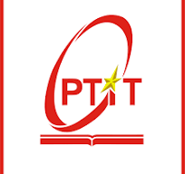

# Education

 

## Bachelor’s Degree in Information Technology
**[Posts and Telecommunications Institute of Technology (PTIT)](https://portal.ptit.edu.vn/)**  
_Hanoi, Vietnam_  

- Graduated with a GPA of 3.65/4 and TOEIC score of 690.
- Ranked among PTIT’s top 10 graduating theses.
- Received a Commendation by Vietnam’s Minister of Information and Communications, Nguyen Manh Hung ([Details](https://www.facebook.com/HocvienPTIT/photos/a.1337706119637128/8089684347772571/)).
- Authored an accepted paper for FAIR 2024 on enterprise DBaaS with OpenStack Trove ([Details](https://drive.google.com/file/d/1UP12xblSDyQLBufYA38TzoVrzvtt6Jxh/view?usp=drive_link)).
- Awarded scholarships for semesters for academic excellence.
- Earned the Encouragement Award at ICPC PTIT 2022.
- Received an entrance scholarship to PTIT.